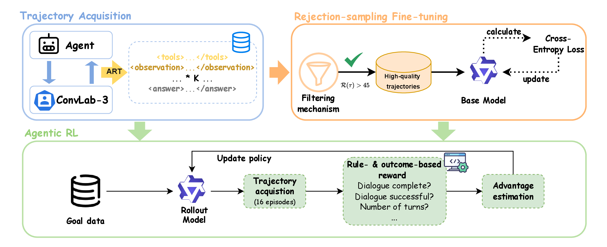
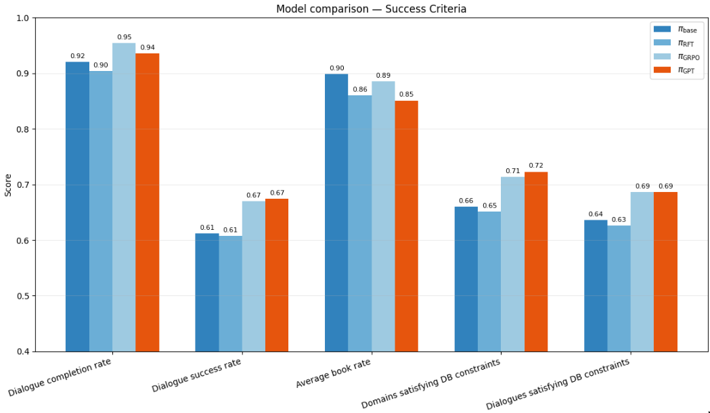
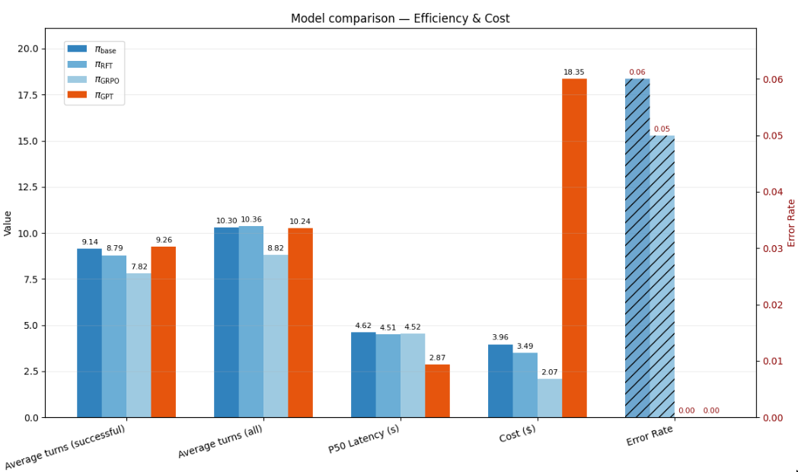
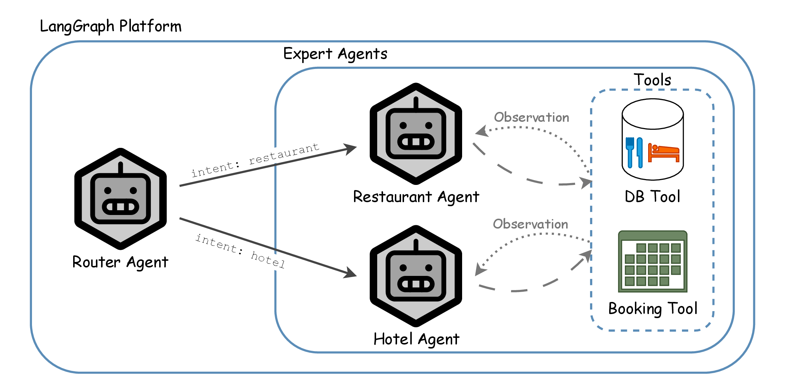

# Agentic RL in Multi-agent Conversational AI for Telecommunication Systems
Within the context of my master's thesis, this repo showcases the application of GRPO to achieve or exceed GPT-4's performance with open-source models on multi-turn dialogue. Specifically, we align a Qwen2.5-14B model with the [MultiWOZ](https://github.com/budzianowski/multiwoz) objectives, while improving operational metrics such as cost and latency, and facilitating data sovereignty.
Additionally, this repo illustrates that an initial SFT training fails to effectively improve multi-turn dialogue-level performance, while GRPO proves to be the critical breakthrough.

## Training Framework
The [ART-LangGraph](https://art.openpipe.ai/integrations/langgraph-integration) integration helps capturing the interaction traces between the user and the agent. As illustrated by the figure below, we will run a preliminary SFT training on high-quality data to try to improve the model's baseline performance, followed by agentic RL.

<div style="text-align: center;">
  
</div>

## Results
The dialogue success rate of the GRPO-tuned policy ($\pi_{GRPO}$) is en par with the GPT-4.1-based policy. The database satisfaction metrics show the positive effect of GRPO training on tool call adherence.

<div style="text-align: center;">
  
</div>

Interestingly, the turn-level penalty of -1 motivates the Qwen2.5-14B-induced policy to achieve dialogue success more efficiently (only 8.8 turns on average), at the same time reducing cost and facilitating data souverignty. Not only does this reduce the effort required by the user to achieve its goal, but also saves money! With some more engineering effort, you will also be able to significantly decrease the latency over API-based proprietary models.
<div style="text-align: center;">
  
</div>

## Architecture
The architecture is inspired by a production system and has been adapted to the MultiWOZ hotel and restaurant domain. The agent is subdivided into a routing agent, that routes the query to the appropriate agent based on its contents. Also, to facilitate context isolation and capture of interaction traces for model alignment, there exist two expert agents: the restaurant and hotel agent that have access to a database for their respective domains and a booking tool to make hotel booking or table reservations. 

<div style="text-align: center;">
  
</div>

## Getting Started
Install the project dependencies by running `uv sync`.

To provision a GPU for the training, this repo follows the recommendations from OpenPipe's [Open Deep Research Training](https://github.com/OpenPipe/open_deep_research_training) and uses RunPod.

You'll want to run the scripts in this order:
```
uv run collect_sft.py # Collect samples for your sft training run. ~1 Hour
uv run run_sft.py # Run your sft training run. ~1 Hour
uv run run_train.py # Run your rl training run. >1 Day
```
For benchmarking, run `uv run run_eval.py`.

## Acknowledgements
This project builds upon the work of [ConvLab-3](https://github.com/ConvLab/ConvLab-3) and [Openpipe's Open Deep Research](https://github.com/OpenPipe/open_deep_research_training).
Huge thanks to the ART and ConvLab maintainers for giving extremely valuable feedback.
